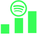

# Spotify Stats 

A website for viewing your top artists and songs from different time frames and more!

Access at: https://spotify-stats-php.herokuapp.com/

Features include:

⋅ Ability to see your most listened to artists and songs from 4 weeks ago, 6 months ago or 2 years ago.

⋅ Ability to auto generate a playlist based on your top artists and songs from one of the previously mentioned time frames.

⋅ Ability to get recommendations for similar artists based on an aritst you chose from the time frames mentioned above.

## Top artists and songs from 4 weeks ago

## Artist recommendations 

